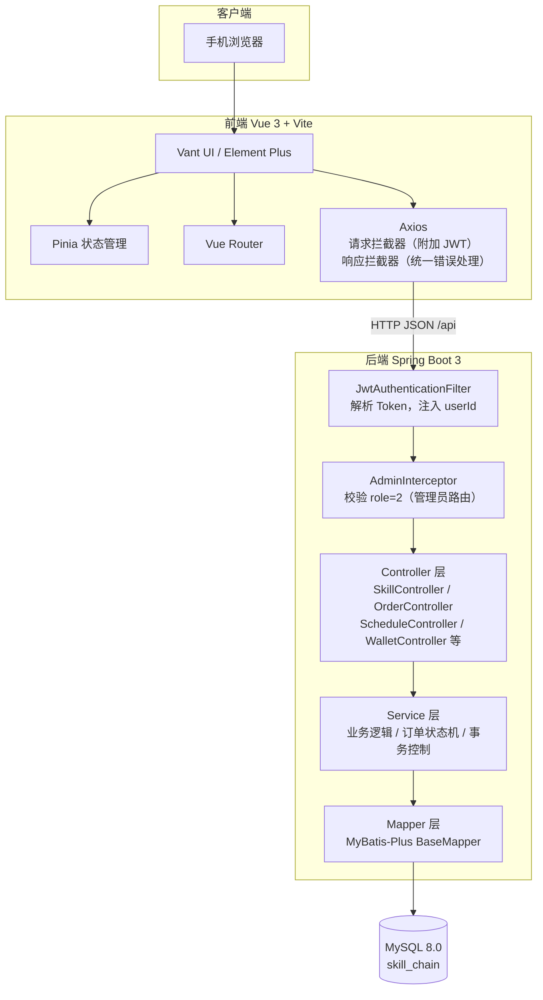
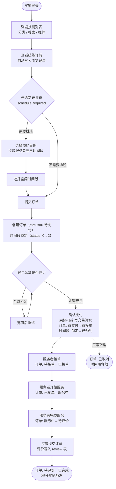
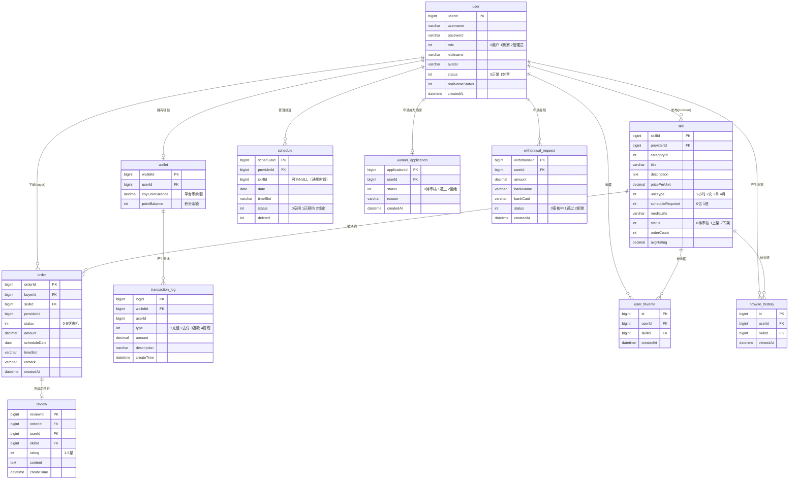

# SkillChain 核心图表（Mermaid 版）

---

## 图 1：系统总体架构图

**结构草稿**
- 客户端：手机浏览器运行 Vue3 单页应用
- 前端层：Vue3 + Vant / Element Plus + Pinia + Vue Router，Axios 附加 JWT Token 发请求
- 网络层：HTTP/JSON，所有请求前缀 /api
- 后端层：Spring Boot → JWT Filter → Controller → Service → MyBatis-Plus Mapper
- 数据层：MySQL 8.0，数据库 skill_chain

---

## 图 2：功能模块图

**结构草稿**
- 三个端：买家端 / 服务者端 / 管理端
- 买家：浏览→收藏→浏览记录→预约下单→支付→订单→评价→签到
- 服务者：发布技能→排班管理→接单处理→收益提现
- 管理：用户/技能/订单/提现/商家审核/公告

```mermaid
graph TB
    Root["SkillChain 技能链平台"]

    Root --> Buyer["买家端"]
    Root --> Provider["服务者端"]
    Root --> Admin["管理端"]

    Buyer --> B1["技能浏览\n分类筛选 / 搜索 / 推荐"]
    Buyer --> B2["技能详情\n描述 / 评价 / 可用时间段"]
    Buyer --> B3["收藏管理\n添加 / 取消 / 列表"]
    Buyer --> B4["浏览记录\n自动记录 / 清空"]
    Buyer --> B5["预约下单\n选择日期和时间段"]
    Buyer --> B6["钱包\n余额 / 充值 / 支付 / 提现"]
    Buyer --> B7["订单管理\n多状态 Tab / 我的预约"]
    Buyer --> B8["评价系统\n提交评价 / 查看评价"]
    Buyer --> B9["每日签到\n积分奖励"]

    Provider --> P1["技能管理\n发布 / 编辑 / 上下架"]
    Provider --> P2["排班管理\n添加时间段 / 删除空闲时间段"]
    Provider --> P3["技能订单处理\n接单 → 开始服务 → 完成服务"]
    Provider --> P4["收益管理\n统计 / 提现申请"]

    Admin --> A1["用户管理\n查看 / 封禁 / 启用"]
    Admin --> A2["技能审核\n上架 / 下架"]
    Admin --> A3["订单监控\n全平台订单查看"]
    Admin --> A4["提现审批\n通过 / 拒绝"]
    Admin --> A5["商家入驻审核\n通过后 role 升级为 1"]
    Admin --> A6["公告管理\n发布 / 管理系统公告"]
```

---

## 图 3：订单业务流程图

**结构草稿**
- 主路径：浏览→详情→选时间→下单→支付→接单→开始→完成→评价
- 分支：余额不足走充值，无排班需求直接下单
- 状态机：0待支付→1待接单→2已接单→3服务中→4待评价→5已完成
- 时间段状态联动：空闲(0)→锁定(2)→已预约(1)

---

## 图 4：数据库 ER 图

**结构草稿**
- user 1对1 wallet（每用户一个钱包）
- user 1对多 skill（服务者发布多个技能）
- user 1对多 order（买家下多个订单）
- skill 1对多 order
- wallet 1对多 transaction_log
- order 1对1 review（一订单一评价）
- user 1对多 schedule（服务者管理时间段）
- user 1对多 user_favorite / browse_history
- skill 1对多 user_favorite / browse_history
- user 1对1 worker_application
- user 1对多 withdrawal_request

