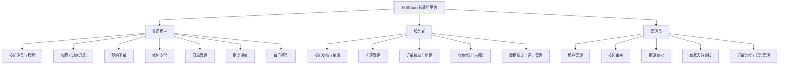

# SkillChain 技能链 — 中期答辩材料

---

## 一、答辩讲解稿

我们设计并实现了一个名为 SkillChain 技能链的技能共享预约服务平台。该平台的核心定位是：让有技能的人能够发布服务，让需要服务的人能够便捷预约、在线支付，形成一个完整的技能交易闭环。

系统共设计了三类用户角色，分别承担不同职责。

普通用户是平台的消费方。他们可以浏览平台上所有技能服务，通过分类筛选或关键词搜索找到感兴趣的服务，收藏喜欢的技能，查看自己的浏览记录，并在技能详情页选择服务者提供的可用时间段，完成预约下单。下单后通过平台内置钱包完成支付，订单进入服务流程。服务完成后，用户可以提交评价，完成整个购买闭环。

服务者是平台的供给方。他们可以在平台发布自己的技能服务，设置价格和服务方式，并通过排班管理系统添加自己的可预约时间段，供买家选择。当买家完成下单支付后，服务者在订单中心接单，依次推进服务状态——从接单、开始服务到完成服务，整个过程有完整的状态流转记录。服务完成后，服务者的收益进入账户，可申请提现。

管理员负责平台的日常运营与审核工作。他们可以审核用户发布的技能是否符合上架标准，处理用户提交的提现申请，审批普通用户升级为服务者的申请，同时对全平台的用户、订单和评价进行统一管理与监控，保障平台正常运转。

---

## 二、功能模块划分

### 普通用户

- 技能浏览（分类筛选 / 关键词搜索 / 推荐排序）
- 技能详情查看（服务描述 / 用户评价 / 可用时间段）
- 收藏管理（添加收藏 / 取消收藏 / 收藏列表）
- 浏览记录（自动记录 / 历史列表 / 一键清空）
- 预约下单（选择时间段 / 填写备注 / 确认下单）
- 钱包支付（余额充值 / 在线支付 / 交易流水查看）
- 订单管理（全部订单 / 待支付 / 待服务 / 已完成 / 我的预约）
- 提交评价（星级评分 / 文字评价）
- 每日签到（获取积分奖励）

### 服务者

- 技能管理（发布技能 / 编辑技能 / 上下架控制）
- 排班管理（添加可预约时间段 / 删除空闲时间段 / 防重复检测）
- 订单处理（接单 / 开始服务 / 完成服务）
- 收益管理（收益统计 / 提现申请 / 提现记录）
- 数据统计（技能数量 / 完成订单数 / 平均评分）
- 评价管理（查看所有技能收到的评价）

### 管理员

- 用户管理（用户列表 / 封禁与启用）
- 技能审核（待审核列表 / 通过 / 驳回）
- 订单监控（全平台订单查看）
- 提现审批（审核提现申请 / 通过或拒绝）
- 商家审核（入驻申请审核 / 通过后角色升级）
- 评价管理（查看与管理平台评价）
- 公告管理（发布与维护系统公告）

---

## 三、系统功能模块图

---

## 四、业务流程总结

用户浏览技能、选择服务者提供的可用时间段后完成预约下单，通过平台钱包支付，服务者接单后推进至服务完成，用户提交评价，整个交易闭环结束。
